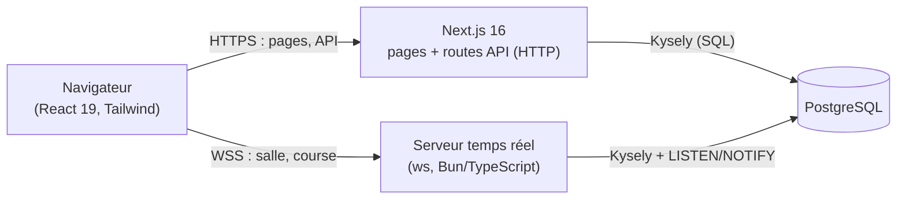
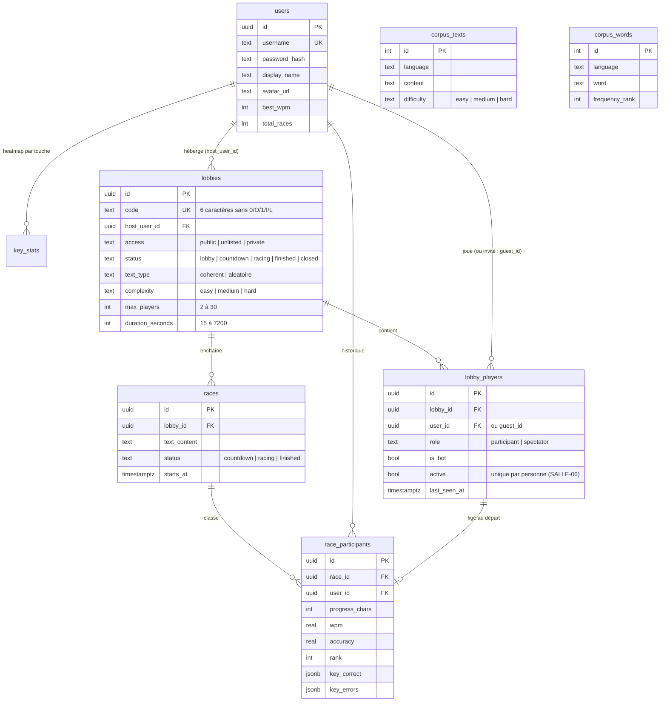
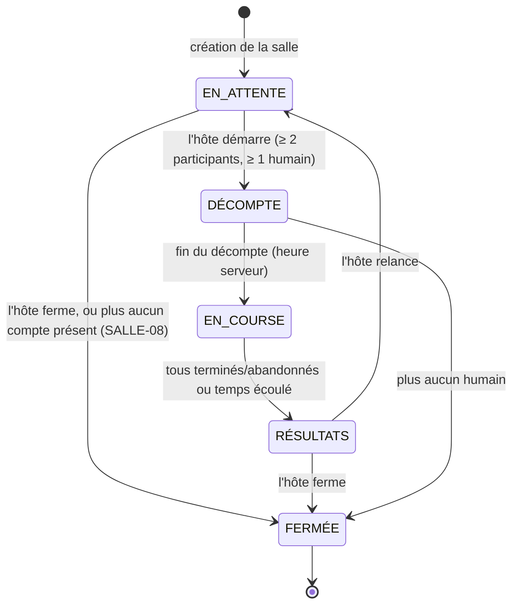

# Architecture de KeyMine

Document vivant : il décrit les choix techniques et leur justification. L'état d'avancement exigence par exigence est dans [`EXIGENCES.md`](./EXIGENCES.md) ; ce document explique le *pourquoi*. Version initiale du checkpoint 1.

## 1. Vue d'ensemble

Deux processus applicatifs partagent la même base :

- **Next.js** sert les pages et les routes API HTTP (authentification, création/entrée en salle, profil, historique, résultats). Toute entrée est validée par Zod (TECH-07).
- **Le serveur temps réel** (`realtime/`) porte les WebSocket : présence dans la salle d'attente et déroulement des courses. Il est le **seul autorité** pendant une course (COURSE-06).

PostgreSQL est la source de vérité durable. Les deux processus ne s'appellent pas entre eux : ils se coordonnent par la base (écritures + notifications `LISTEN/NOTIFY`).

## 2. Modèle de données

Points notables :

- **Une seule salle par personne (SALLE-06)** est garantie par la base, pas seulement par l'interface : deux index uniques partiels (`lobby_players_one_room_user` / `_guest`, `where active`). Un déclencheur libère les joueurs quand la salle passe à `closed`.
- **Invités** : pas de ligne `users` ; identité = cookie JWT signé (`km_guest`) avec pseudonyme, stockée dans `lobby_players.guest_id`. À la connexion, l'historique de l'invité est fusionné dans son compte.
- **Corpus en base (CONF-03)** : `corpus_texts` (passages du domaine public, difficulté calculée) et `corpus_words` (dictionnaire classé par rang de fréquence), remplis par `db/seed.ts`.
- **Migrations** : fichiers SQL versionnés dans `db/migrations/`, appliqués par `db/migrate.ts` (table `_migrations`). Types Kysely écrits à la main dans `db/types.ts`.

## 3. Machine à états de la course (COURSE-01)

États du cahier : `EN_ATTENTE → DÉCOMPTE → EN_COURSE → RÉSULTATS → (EN_ATTENTE | FERMÉE)`, stockés dans `lobbies.status`.

| État du cahier | Valeur en base | Ce qui est possible |
| --- | --- | --- |
| EN_ATTENTE | `lobby` | On rejoint, on quitte ; l'hôte règle la salle, ajoute des bots, expulse, démarre (≥ 2 participants dont ≥ 1 humain). |
| DÉCOMPTE | `countdown` | Décompte synchronisé 3-2-1 ; le texte n'est envoyé qu'au début du décompte ; on ne peut plus rejoindre (SALLE-09). |
| EN_COURSE | `racing` | Frappe, progression serveur-autoritaire, bonus, abandon, reconnexion sous 30 s. |
| RÉSULTATS | `finished` | Podium, tableau, graphiques ; l'hôte relance (→ EN_ATTENTE) ou ferme (→ FERMÉE) ; on peut encore rejoindre. |
| FERMÉE | `closed` | Plus d'accès ; les joueurs sont libérés (déclencheur SQL). |

Les transitions autorisées sont codées dans une table unique (`lib/race/state.ts`) et testées ; toute écriture de `lobbies.status` passe par elle.

## 4. Temps réel : ADR-001

**Décision** : WebSocket (bibliothèque `ws`) dans un processus séparé, avec `LISTEN/NOTIFY` PostgreSQL pour propager les changements de salle.

**Contexte** : il faut (a) une liste de présence à jour sans rechargement, (b) une piste de progression avec ≥ 4 mises à jour perçues par seconde, (c) un serveur autoritaire, (d) un déploiement simple sur un seul VPS.

| Option | Pour | Contre |
| --- | --- | --- |
| Polling HTTP | Trivial | Latence, charge, pas de poussée serveur ; refusé comme mécanisme principal (gardé en repli). |
| Server-Sent Events | Simple, reconnexion native | Un seul sens : la progression des joueurs devrait passer par des POST. |
| MQTT | Pub/sub mûr | Broker supplémentaire à déployer et sécuriser, mal adapté à l'état autoritaire. |
| **WebSocket (`ws`)** | Bidirectionnel, faible latence, simple | Process à part (Next.js ne gère pas bien les WS persistants). |

**Conséquences** :

- Authentification à la connexion par les **cookies signés** (`km_session` / `km_guest`) vérifiés avec le même secret ; contrôle de l'en-tête `Origin` ; sans cookie valide la connexion est fermée (code 4401).
- Tous les messages entrants sont décrits par des schémas **Zod** (`realtime/protocol.ts`) ; un message invalide est ignoré, un flux trop rapide est limité (PERF-02).
- Salle d'attente : des triggers SQL émettent `pg_notify('lobby_changed', code)` ; le serveur temps réel écoute, recharge l'instantané et pousse à chaque client **sa** vue (qui est l'hôte, qui est moi, qui est connecté). Les battements de présence n'émettent pas de notification.
- Repli : si le WebSocket échoue, la page de salle interroge l'API HTTP et envoie un battement de présence ; le WebSocket est retenté en arrière-plan.
- Présence : l'hôte absent 30 s est remplacé par le compte connecté présent depuis le plus longtemps ; s'il n'en reste aucun, la salle est fermée (SALLE-08). Un joueur silencieux 60 s est libéré.

## 5. Course serveur-autoritaire (COURSE-06)

Le client n'envoie que son **avancement** (caractères validés, erreurs, compteurs par touche). Le serveur :

- fixe lui-même l'heure de départ et de fin ;
- recalcule le MPM (`caractères corrects / 5 / minutes`) ; un MPM fourni par le client n'est jamais lu ;
- **rejette les progressions impossibles** : retour en arrière, saut supérieur à ce que permet la vitesse maximale (250 MPM) plus une petite marge, dépassement de la longueur du texte ;
- calcule le classement (COURSE-10) et applique les bonus.

## 6. Bots (BOT-01 à BOT-05) : approche

Les bots sont simulés **côté serveur** par un moteur pur et **déterministe** : `(niveau, graine, texte, temps écoulé) → caractères tapés`. La graine rend le moteur testable unitairement (même graine ⇒ même course).

- Cinq niveaux (Noob, Débutant, Intermédiaire, Expert, Impossible) avec une plage de MPM et un taux d'erreur ; valeurs ajustées et documentées dans `lib/race/bots.ts`.
- La vitesse **varie** : bruit lissé (accélérations/ralentissements), hésitations aléatoires, ralentissement sur les mots longs ou accentués.
- Une erreur coûte du temps de correction ; en mode « correction obligatoire » le bot s'arrête jusqu'à avoir corrigé, en mode « libre » il continue et l'erreur est comptée.
- Les bots reçoivent bonus et malus comme les humains et sont identifiés dans l'interface.

## 7. Bonus de remontée (BONUS-01 à 04) : règle documentée

Quand les bonus sont activés :

1. Les points de contrôle sont atteints quand le **meneur** passe 25 %, 50 % et 75 % de **son** texte.
2. À chaque point de contrôle, est « en retard » tout participant qui est **dernier** ou à **plus de 25 points de pourcentage** derrière le meneur (le meneur lui-même n'est jamais en retard).
3. Chaque joueur en retard reçoit **un** bonus par point de contrôle, **3 au maximum par course**.
4. Types (tirés avec la graine de la course) : `-3 mots` (retire 3 mots au texte du retardataire), `+3 mots` (ajoute 3 mots au texte du meneur), `brouillard` (les prochains mots du meneur sont flous quelques secondes).
5. La progression est toujours calculée **par rapport au texte courant du joueur** ; le MPM brut compte les caractères réellement tapés, ce qui reste cohérent quand un texte est allongé ou raccourci.

## 8. Complexité du texte (CONF-05) : critères mesurables

Mot (texte aléatoire) :

- **facile** : 2 à 5 lettres, sans accent ;
- **moyen** : 4 à 8 lettres ;
- **difficile** : 7 lettres ou plus, ou mot accentué de 6 lettres ou plus.

Passage (texte cohérent), mesuré à l'import (`lib/text/difficulty.ts`) : longueur moyenne des mots et part de caractères « spéciaux » (accents, ponctuation, chiffres) :

- **facile** : longueur moyenne ≤ 4,8 et spéciaux ≤ 3 % ;
- **difficile** : longueur moyenne ≥ 5,6 ou spéciaux ≥ 8 % ;
- **moyen** : le reste.

Choix pour CONF-06/07 : en mode cohérent, les options (accents, ponctuation, majuscules, nombres) **adaptent** le passage au lieu de le rejeter ; l'inclusion/exclusion de caractères est **désactivée** en mode cohérent et ne s'applique qu'au texte aléatoire (l'exclusion l'emporte sur l'inclusion).

## 9. Authentification et sécurité

- Comptes : mot de passe haché (bcrypt), session JWT en cookie `httpOnly`, `sameSite=lax`, `secure` en production ; verrouillage temporaire après des échecs répétés ; OAuth Discord/GitHub optionnels.
- Invités : pseudonyme (3 à 20 caractères) dans un cookie JWT signé ; un invité **ne crée pas** de salle et ne peut pas être hôte.
- Validation : Zod sur toutes les routes et tous les messages temps réel ; requêtes SQL paramétrées (Kysely) ; WebSocket protégé par origine + cookie ; limitation de débit des messages.

## 10. Stratégie de tests

| Niveau | Outil | Ce qui est couvert |
| --- | --- | --- |
| Unitaires | Vitest | Génération et complexité du texte, protocole Zod, limiteur, authentification WebSocket, bots, états. |
| Intégration base | Vitest + Postgres réel (`bun run test:db`) | Contraintes SALLE-06, notifications, balayage d'hôte, règles d'entrée en salle, seed idempotent, serveur temps réel complet avec vrais cookies. |
| Bout en bout | Playwright | Parcours principaux (accueil, création, entrée en salle). |
| CI | GitHub Actions | Lint, typecheck, tests unitaires ; Postgres 18 pour migrations, tests base, build et e2e. |

## 11. Décisions notables (ADR courts)

- **ADR-002 — Kysely plutôt qu'un ORM complet.** Le cahier laisse le choix de l'« ORM ». Kysely est un *query builder* typé : le SQL reste visible, les migrations sont du SQL versionné, pas de génération de code ni de moteur binaire à déployer. Compromis : les types de tables sont écrits à la main.
- **ADR-003 — Bun.** Un seul outil pour installer, exécuter les scripts TypeScript (migrations, seed, serveur temps réel) et lancer les tests ; le même binaire sert en production.
- **ADR-004 — Rôle d'hôte réservé aux comptes.** « Personne humaine connectée » est interprété comme un compte : un invité ne peut pas créer de salle (AUTH), donc pas la gérer non plus.
