# Démarche créative

> Ce document est rédigé **par l'équipe humaine**, sans IA générative (exigences DES-01 à DES-03). Le nom, le logo et le choix des couleurs viennent de l'étudiant ; l'assistant n'a fait que corriger l'orthographe, mettre en forme le texte et relever les valeurs techniques (codes de couleurs, polices, licences).

## Nom du projet

**KeyMine.**

Le but est de créer un site qui attire les jeunes des écoles. Pour ça, je voulais partir d'un jeu qui est déjà très populaire chez eux : ça peut attirer l'attention de plusieurs élèves d'un coup et ça donne un côté amusant au site. « Key » (les touches du clavier) et « Mine » (le minage de Minecraft) racontent en deux mots que c'est un jeu de frappe, avec l'univers des jeux vidéo.

## Logo

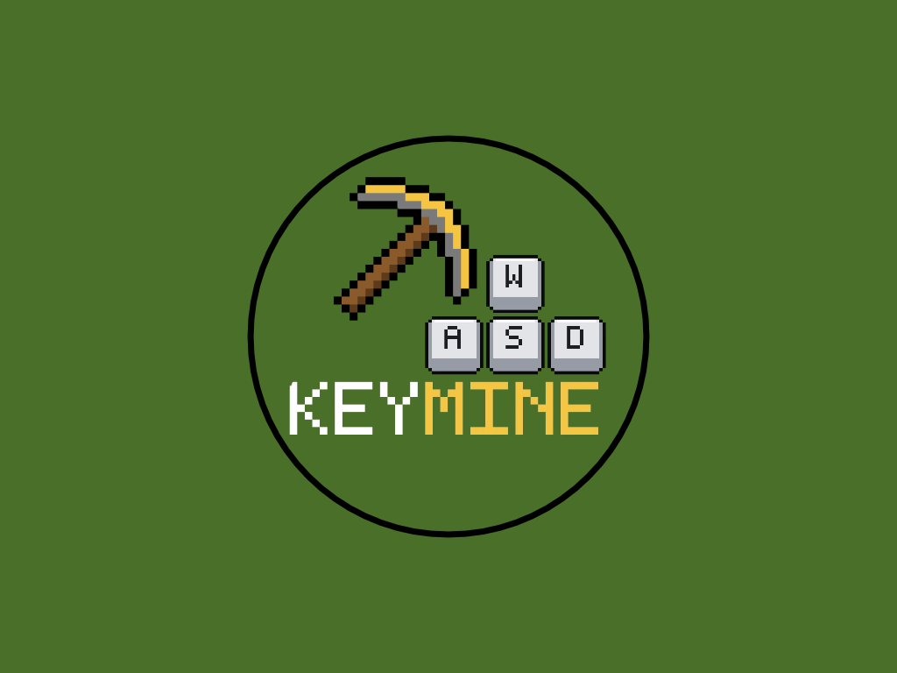

**L'idée.** J'aime beaucoup les pixels, et Minecraft est un jeu entièrement fait de pixels (de gros blocs carrés). C'est ce qui m'a amené à faire un logo en pixels : il est dans le même univers que le nom, et il se reconnaît tout de suite dans le style du site.

**Comment je suis arrivé au logo final.**

1. **Mes essais ratés.** Avant le logo final, j'ai fait plusieurs essais que je n'aimais pas. J'ai d'abord voulu tester un logo avec seulement des lettres. Ensuite j'ai essayé « KEY » en lettres lisses grises, avec une pioche grise en relief, un cercle noir et un fond de gros carrés verts. Je n'étais pas fan du résultat, et surtout ça ne faisait pas pixel, alors que c'est justement ce que j'aime. Ça m'a poussé à chercher des éléments vraiment en pixels.

   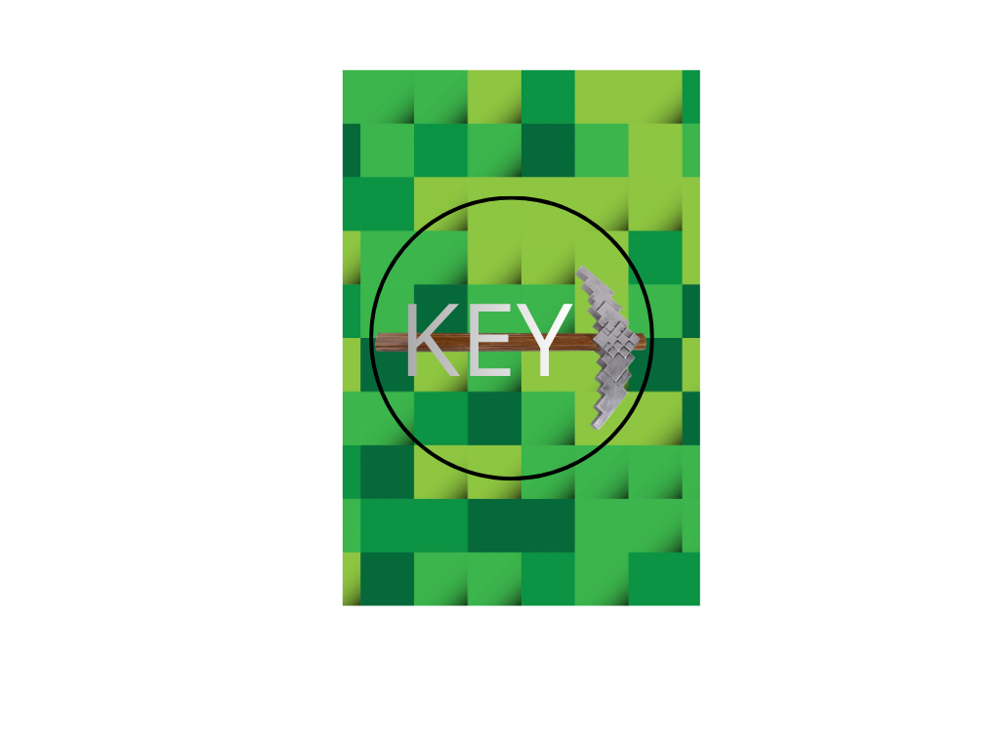

2. **J'ai cherché mes ingrédients.** Les sources sont dans la section Moodboard plus bas. J'ai gardé :
   - une pioche de Minecraft en pixels, trouvée avec une recherche d'images (j'ai pris la version en or plutôt que celle en fer) ;
   - des touches de clavier en pixels (un W, puis le bloc W A S D, et un K), dessinées avec le même convertisseur de pixel art que le texte (on voit la grille sur l'image du W) ;
   - un texte « KEYMINE » fait avec ce convertisseur de texte en pixel art.

   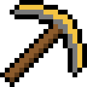 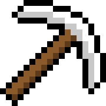 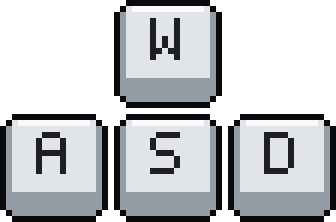 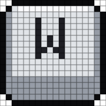

3. **Le texte en vrai pixel art.** J'ai écrit le mot « KEYMINE » avec le convertisseur de texte en pixel art de BatchImageTools : on dessine les lettres avec des chiffres dans une grille, puis on donne une couleur à chaque chiffre. J'ai mis « KEY » en blanc et « MINE » en or. Là, le côté bloc de Minecraft ressortait enfin.

   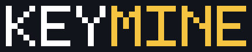

4. **L'assemblage dans Canva.** J'ai ensuite tout assemblé dans Canva : un fond vert uni, un cercle noir, le texte pixel au centre, la pioche en or pour le côté « mine », et les touches de clavier **W A S D** (les touches avec lesquelles on se déplace dans Minecraft). Au début j'avais seulement une touche W, puis j'ai ajouté A, S et D pour former le vrai bloc de déplacement.
5. **Résultat.** La pioche et les touches se rejoignent au-dessus du texte : on lit « clavier » et « Minecraft » dans la même image. Et oui, c'est une pioche en or, qui est la plus forte en couleur et la plus nulle dans le jeu (mais ça va bien avec le jaune du site 🙂).

**Variantes et usages.**

- Version complète (`logo/keymine-logo.png`, 1024 × 768) : pour les documents et les présentations.
- Version ronde (`logo/keymine-rond.png`) : juste le cercle noir et ce qu'il contient, coins transparents. Elle sert d'icône d'onglet (favicon, `app/favicon.ico` et `app/icon.png`) et de logo dans l'en-tête du site (`public/logo-rond.png`).
- Dans l'en-tête, le cercle est accompagné du mot reconstitué avec de petites touches de clavier (K, E, Y) suivies de « MINE » : à cette taille, le texte du logo serait trop petit pour être lu, alors on le répète en grand à côté. Sur un très petit téléphone (moins de 440 px de large), je garde seulement le cercle et « MINE » pour que l'en-tête tienne.

## Moodboard

Cinq références que j'ai regardées en cherchant l'ambiance du site, chacune avec sa capture d'écran et sa source.

### 1. Un fond de gros carrés verts

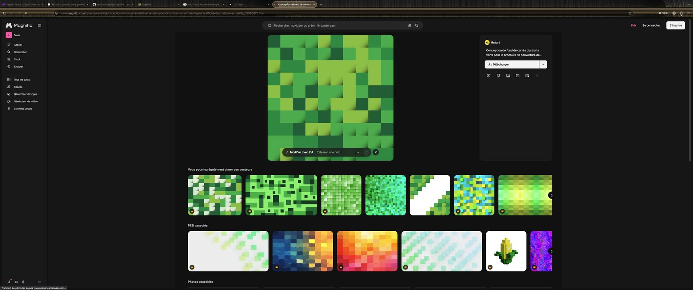

Vecteur gratuit « conception de fond de carrés abstraits verts » (auteur : flatart), sur [Magnific](https://www.magnific.com/fr/vecteurs-libre/conception-fond-carres-abstraits-verts-pour-brochure-couverture-depliant-affiche-illustration-vectorielle_35966976.htm) (anciennement Freepik), trouvé avec la recherche [« fond écran minecraft creeper »](https://www.magnific.com/fr/photos-vecteurs-libre/fond-ecran-minecraft-creeper). Ce sont de gros blocs verts de tons différents, qui rappellent l'herbe de Minecraft. Il a servi à mon essai raté, pas au logo final. La licence gratuite demande de citer l'auteur : à garder en tête si on le réutilise.

### 2. Les fonds d'écran Minecraft

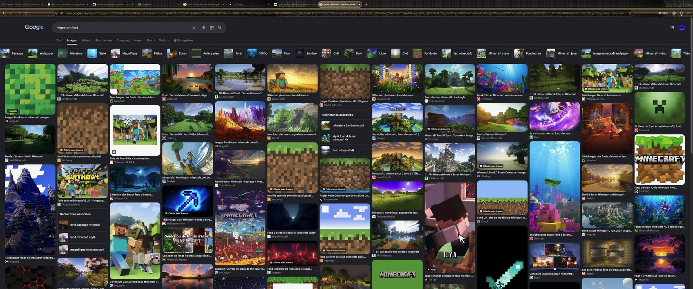

Recherche d'images Google [« minecraft fond »](https://www.google.com/search?q=minecraft+fond), pour l'ambiance générale du jeu : paysages, terre et herbe en gros blocs, ciel, titre du jeu en lettres de pierre.

### 3. La pioche de Minecraft

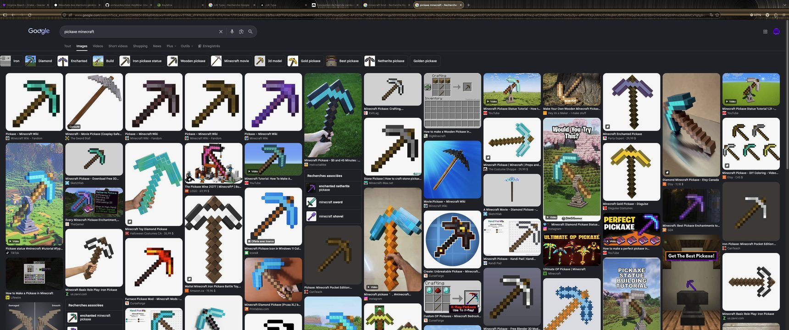

Recherche d'images Google [« pickaxe minecraft »](https://www.google.com/search?q=pickaxe+minecraft), où j'ai trouvé la pioche en pixels du logo (la version en or, celle en fer et les autres matériaux sont proposées dans les résultats).

### 4. Une palette de verts

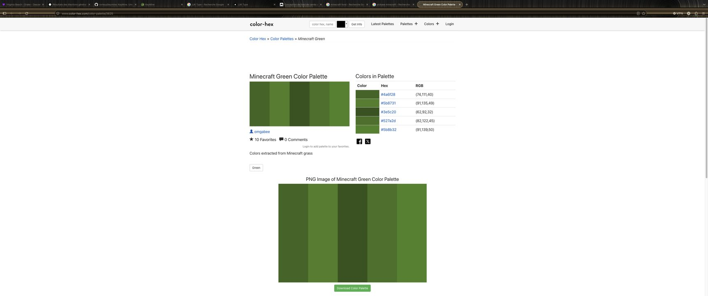

[Minecraft Green Color Palette](https://www.color-hex.com/color-palette/3625) (color-hex.com, par omgabee) : cinq verts « extraits de l'herbe de Minecraft » (`#4a6f28`, `#5b8731`, `#3e5c20`, `#527a2d`, `#5b8b32`). Le fond vert de mon logo (`#4A6F28`) est le premier de cette liste.

### 5. Les codes de couleurs du jeu

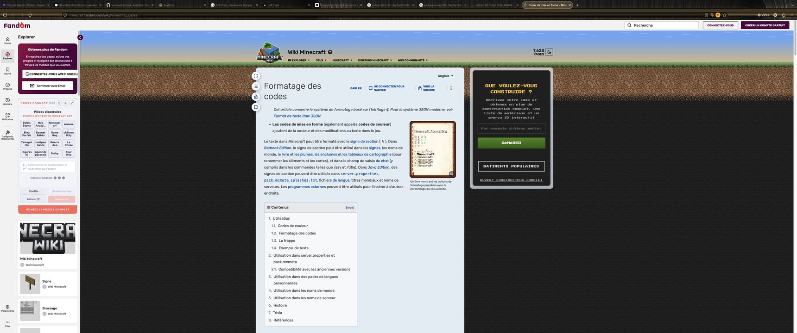

Page [« Formatage des codes »](https://minecraft.fandom.com/wiki/Formatting_codes) de la Minecraft Wiki, pour retrouver les couleurs que le jeu utilise pour son texte.

### Outils pour fabriquer le logo

- **Le texte et les touches en pixels.** [BatchImageTools, convertisseur de texte en pixel art](https://www.batchimagetools.com/fr/convert-text-to-pixel-art) (celui que j'ai gardé, pour le texte comme pour les touches) et [Wplace Text to Pixel](https://wplace.style/text-to-pixel) (testé aussi).
- **L'assemblage.** [Canva](https://www.canva.com/) pour placer le cercle, la pioche, les touches et le texte.

## Palette de couleurs

Je suis parti du **vert** et du **jaune/or** : ce sont les couleurs fortes de Minecraft (l'herbe, les creepers, et l'or de la pioche). Pour m'y retrouver, j'ai regardé la palette de verts de color-hex.com et les codes de couleurs de la Minecraft Wiki (références 4 et 5 du Moodboard). Le reste vient de la terre et du bois du jeu : un brun foncé pour le fond, un beige crème pour les panneaux. Un rouge franc sert uniquement pour les actions dangereuses.

| Rôle | Couleur | Code |
| --- | --- | --- |
| Fond du site (thème sombre) | brun terre | `#2B1E13` (plus foncé : `#1B1209`) |
| Fond du site (thème clair) | sable | `#CDBF9C` (plus foncé : `#A8966E`) |
| Panneaux et cartes | crème | `#F1E6C9` |
| Panneaux, gris de touches | gris pierre | `#C6C6C6`, ombre `#6B6B6B` |
| Action principale (jouer, créer, démarrer) | vert | `#3F7D24` (clair `#7FC45A`, foncé `#23501A`) |
| Herbe, accents verts | vert herbe | `#5E9C3A` |
| Accent, mise en valeur, bouton « modifier » | or | `#F0B429` (clair `#FFE08A`, foncé `#9A6B0A`) |
| Danger (supprimer, fermer la salle, lettre interdite) | rouge | `#B0281C` (clair `#F39A8C`, foncé `#5E140D`) |

**Les couleurs du logo** sont un peu à part, parce que je l'ai fait dans Canva : le fond vert est `#4A6F28`, le jaune du mot « MINE » et de la pioche est `#F5C542`, le contour est noir (`#000000`) et les touches sont gris très clair (`#E3E4E8`). Elles sont proches de celles du site (même vert, même or) sans être exactement les mêmes ; je préfère garder le logo tel que je l'ai dessiné.

**Contrastes.** Je les ai vérifiés avec le rapport de contraste WCAG (il faut au moins 4,5 pour du texte normal) : crème sur brun terre 13,0 ; or sur brun terre 8,7 ; blanc sur le vert des boutons 5,0 ; blanc sur le rouge 6,6 ; texte foncé sur les panneaux crème 12,0. De plus, le test d'accessibilité automatique (axe-core) ne relève aucune erreur de contraste sur les pages principales, en thème sombre comme en thème clair.

Toutes ces couleurs sont écrites **une seule fois**, en variables CSS au début de `app/globals.css` : pour changer l'ambiance du site, on modifie ces lignes et tout suit.

## Typographies

Deux polices, toutes les deux libres, installées en local dans `app/fonts/` (le site ne dépend donc pas d'un service externe) :

| Police | Rôle | Auteur | Licence |
| --- | --- | --- | --- |
| **Press Start 2P** | titres, boutons, étiquettes en majuscules, chiffres du code de salle : tout ce qui doit « sonner » jeu vidéo d'arcade | CodeMan38 | SIL Open Font License 1.1 |
| **VT323** | texte courant, descriptions, saisie, texte à taper en course : un pixel plus fin, qui reste lisible en gros paragraphe | Peter Hull | SIL Open Font License 1.1 |

Je les ai trouvées sur Google Fonts. Elles ont toutes les deux un look écran d'ordinateur à pixels, qui va bien avec le logo. La licence OFL permet de les utiliser, les copier et les redistribuer dans un projet, y compris avec le site, à condition de garder leur licence ; la source est donc indiquée ici.

Pourquoi deux polices : Press Start 2P est très large et fatigue vite à lire sur plusieurs lignes, alors je l'utilise pour les mots courts (boutons, titres). Dès qu'il y a une phrase à lire ou un texte à taper, je passe à VT323, qui est plus étroite et plus claire.

## Application dans l'interface

- **Le style « bloc ».** Boutons, panneaux et touches ont des bords carrés, une bordure noire épaisse, un petit relief (un côté clair en haut à gauche, un côté foncé en bas à droite) et une ombre dure qui ne se floute pas. Ça donne l'impression de blocs en pixels, comme dans Minecraft. Au survol, un bouton se soulève un peu ; quand on clique, il s'enfonce, pour que ça réagisse comme une vraie touche.
- **Les couleurs ont toujours le même sens.** Vert = on avance (jouer, créer, enregistrer). Or = action secondaire ou à remarquer (générer un lien, modifier les réglages). Rouge = on supprime ou on ferme. Gris = annuler ou fermer sans rien changer. La même logique sert pour les touches des lettres et des accents dans le formulaire de création : gris = neutre, vert = « souvent », rouge = « jamais ». Et la couleur n'est jamais seule : une petite marque (+ ou ×) et un trait sur le texte aident les personnes qui ne voient pas bien les couleurs.
- **Thème sombre et thème clair.** Le thème sombre (fond brun terre, panneaux crème) est celui que j'ai pensé en premier. Le thème clair garde les mêmes panneaux sur un fond sable. Le site choisit selon le choix de la personne, sinon selon la préférence de son appareil, et le thème est posé avant l'affichage de la page pour éviter un flash de la mauvaise couleur. Un bouton dans l'en-tête permet d'alterner.
- **L'en-tête et le logo.** Le logo rond est tout à gauche de l'en-tête, suivi des lettres K, E et Y en petites touches de clavier (la touche E est verte), puis de « MINE ». L'icône de l'onglet du navigateur est le même logo rond.
- **Sur téléphone.** Les pages tiennent sans défilement horizontal à 360 px de large : les grilles de boutons passent en une colonne, et les grandes cartes (touches du clavier) défilent à l'intérieur de leur zone.
